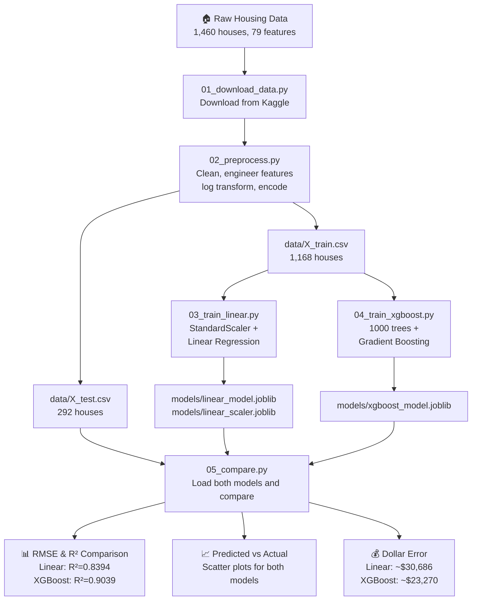

```mermaid
flowchart TD
    A[🏠 Raw Housing Data\n1,460 houses, 79 features] --> B[01_download_data.py\nDownload from Kaggle]
    B --> C[02_preprocess.py\nClean, engineer features\nlog transform, encode]
    C --> D[data/X_train.csv\n1,168 houses]
    C --> E[data/X_test.csv\n292 houses]

    D --> F[03_train_linear.py\nStandardScaler +\nLinear Regression]
    D --> G[04_train_xgboost.py\n1000 trees +\nGradient Boosting]

    F --> H[models/linear_model.joblib\nmodels/linear_scaler.joblib]
    G --> I[models/xgboost_model.joblib]

    E --> J[05_compare.py\nLoad both models and compare]
    H --> J
    I --> J

    J --> K[📊 RMSE & R² Comparison\nLinear: R²=0.8394\nXGBoost: R²=0.9039]
    J --> L[📈 Predicted vs Actual\nScatter plots for both models]
    J --> M[💰 Dollar Error\nLinear: ~$30,686\nXGBoost: ~$23,270]
```